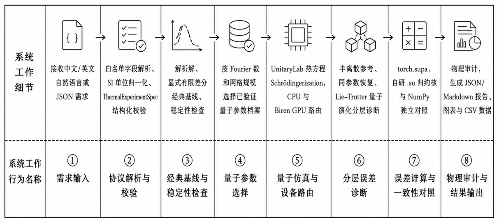
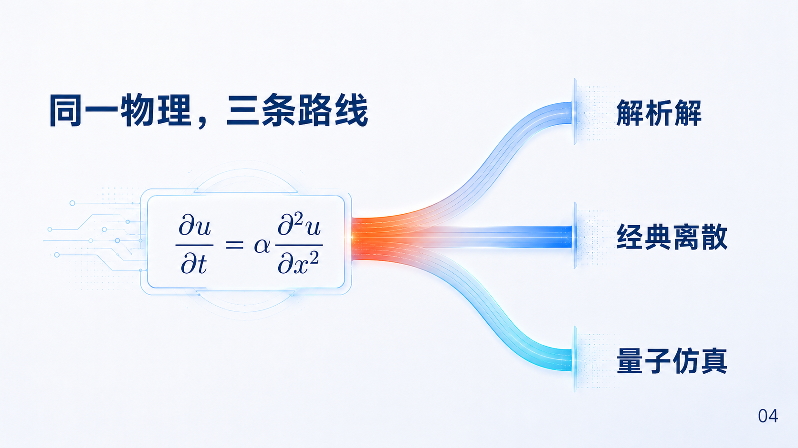
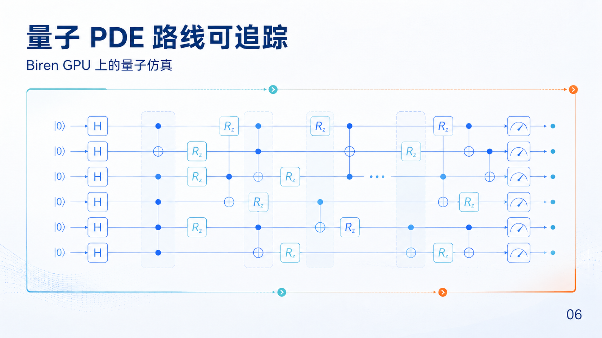
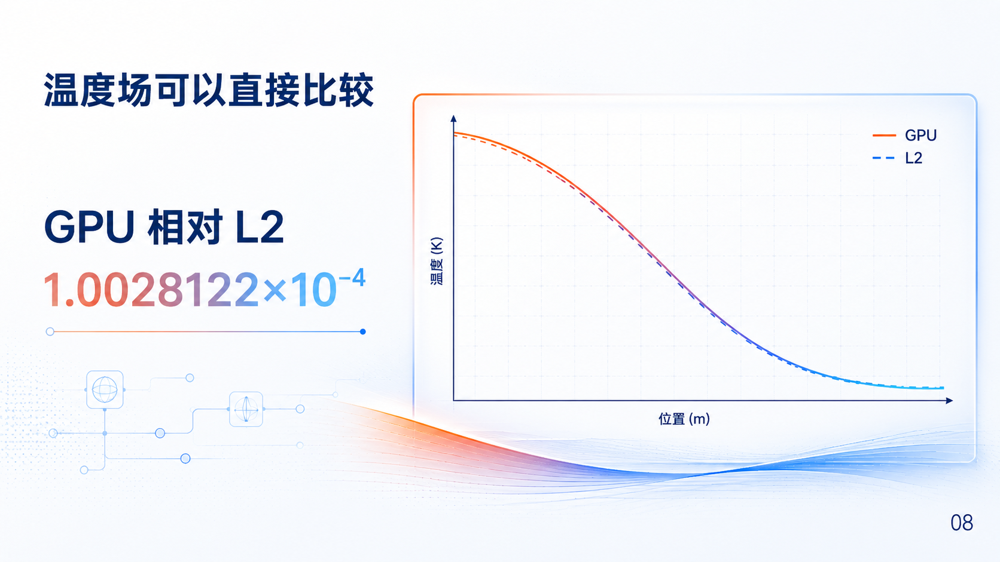
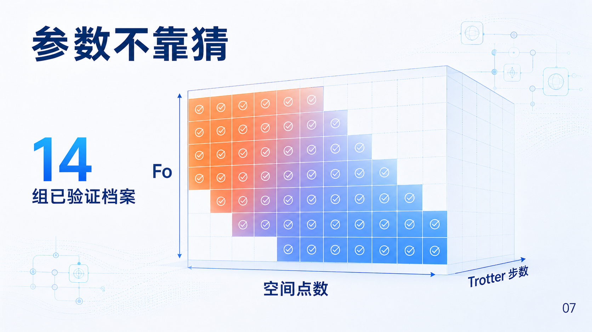

<p align="center">
  <a href="README.md">简体中文</a> · <strong>English</strong>
</p>

# Thermal PDE Audit

[](https://www.python.org/)
[](LICENSE)
[](.github/workflows/cpu-validation.yml)

<p align="center">
  
</p>

**Turn a natural-language heat-conduction problem into an auditable quantum-simulation experiment: executed on Biren GPU infrastructure, checked against classical methods, and reproduced from complete evidence.**

`thermal-pde-audit` targets engineering simulation and equation-solving scenarios in
quantum applications and interdisciplinary exploration. It turns Chinese or English
natural-language requests, or structured parameters, into controlled one-dimensional
heat-conduction experiments. One Agent/Skill workflow produces analytical solutions,
classical finite differences, UnitaryLab Schrödingerization CPU/Biren-GPU quantum-circuit
simulation, dual-SUPA reductions, error decomposition, physical audits, and reproducible reports.

This project is more than a solver script. It is a complete experimental product from
**problem interpretation, through quantum execution, to result acceptance**. Every run records
its inputs, parameters, device routing, numerical metrics, audit conclusions, plots, logs, and
reproduction commands so that results can be demonstrated, compared, and independently reviewed.

## What it delivers

| Capability | Value |
|---|---|
| Natural-language experiment orchestration | Describe length, thermal diffusivity, temperature rise, duration, grid, and device requirements in Chinese or English to create a normalized experiment. |
| Multi-baseline validation | Generate analytical, classical finite-difference, and quantum-simulation results in one run, so a completed run is not mistaken for a correct result. |
| Biren GPU execution | Recheck UnitaryLab CPU/GPU runs with identical parameters in the Biren106M contest environment and record the actual device route. |
| Dual-SUPA numerical audit | Calculate error metrics with both `torch.supa` and the project’s `.su` reduction kernel, independently cross-checking NumPy. |
| Quantum parameter governance | Select Trotter parameters from 14 measured, precise profiles so reproducible experiments use validated configurations first. |
| Layered error explanation | Distinguish spatial discretization, Schrödingerization recovery, Trotter evolution, and device differences. |
| Evidence-based delivery | Export JSON, Markdown, logs, temperature plots, error plots, and quantum-circuit SVGs automatically. |
| Open Skill delivery | Provide a standard Skill structure with documentation, scripts, references, and UI metadata for direct Agent use. |

## A complete quantum-PDE experiment chain

```text
Natural-language / JSON experiment request
            ↓
Whitelisted parameter protocol and SI-unit normalization
            ↓
Analytical solution + explicit finite-difference baseline
            ↓
Precise Fo + grid-size parameter profile
            ↓
UnitaryLab CPU / Biren GPU quantum-circuit simulation
            ↓
Semidiscrete reference + same-parameter recovery + Trotter error decomposition
            ↓
torch.supa + project .su reduction kernel
            ↓
Physical audit, report, plots, logs, and reproduction commands
```

<p align="center">
  
</p>

The system separates natural-language interaction, physical protocol, classical baselines,
quantum execution, device audit, and evidence output into independently testable modules.
See [docs/architecture.md](docs/architecture.md) for the full architecture.

### One physical problem, three comparable routes

Every controlled experiment starts with the same heat equation. Analytical, classical
finite-difference, and UnitaryLab Schrödingerization circuit-simulation routes are evaluated
at the same scale with the same audit metrics, making “the run completed” and “the result is
trustworthy” separate, reviewable conclusions.

<p align="center">
  
</p>

## Quick start

Install development and validation dependencies:

```bash
python3 -m pip install -e ".[dev]"
```

Inspect the current environment and available capabilities:

```bash
python skills/thermal-pde-audit/scripts/doctor.py
```

Turn a natural-language task into a normalized experiment plan:

```bash
python skills/thermal-pde-audit/scripts/algorithm.py \
  --text "Simulate one-dimensional heat conduction over 10 mm with thermal diffusivity 1e-6 m²/s, an initial temperature rise of 100 K, a duration of 0.1 s, and 32 spatial points."
```

The natural-language entry point is not open-ended guessing. It constrains the request through
a parameter whitelist, SI units, and a structured experiment plan before handing it to solving
and audit stages.

<p align="center">
  
</p>

In the contest container, run GPU execution, CPU/GPU comparison, dual-SUPA audit, error
decomposition, and report generation:

```bash
python skills/thermal-pde-audit/scripts/algorithm.py \
  --text "Simulate one-dimensional heat conduction over 10 mm with thermal diffusivity 1e-6 m²/s, an initial temperature rise of 100 K, a duration of 0.1 s, and 32 spatial points; use GPU for a CPU/GPU comparison, dual-SUPA audit, error decomposition, and report generation." \
  --output results/my_thermal_run \
  --full-audit
```

Run the bundled full demonstrations:

```bash
bash skills/thermal-pde-audit/scripts/run-demo.sh
bash skills/thermal-pde-audit/scripts/run-text-demo.sh
```

## Validated results

### A traceable quantum-PDE route

“Quantum” here means UnitaryLab quantum-circuit/state-vector simulation, not a claim of
quantum-hardware execution. The project preserves circuit artifacts, device routing,
same-parameter recovery, and layered-error evidence so that each calculation can be traced
to its execution chain.

<p align="center">
  
</p>

The documented public Skill entry point was run end to end in the Biren106M contest container,
covering natural-language parsing, analytical and finite-difference baselines, UnitaryLab CPU/GPU,
`torch.supa`, the project `.su` kernel, error decomposition, physical audit, and evidence export.

| Metric | Measured result |
|---|---:|
| Full-workflow status | `success` |
| Full-workflow duration | about `35 s` |
| Classical finite-difference relative L2 | `6.47904e-06` |
| GPU quantum-simulation relative L2 | `1.0028122e-04` |
| GPU maximum absolute error | `0.00982698 K` |
| Maximum CPU/GPU field difference | `1.1324883e-04 K` |
| `torch.supa` consistency | Passed |
| Project `.su` kernel consistency | Passed |
| Physical and numerical audit | All passed |

<p align="center">
  
</p>

The project also preserves a unified verification result at `Fo=0.06`, with 32 interior points
and 32 Trotter time slices, and provides:

- 14 precise quantum-parameter profiles that can be traced back to evidence;
- 7 Agent/Skill interaction records covering standard runs, material comparison, CPU/GPU comparison,
  parameter governance, dual SUPA, and natural-language closed loops;
- 55 automated tests and GitHub Actions;
- 10 Origin-friendly CSV tables, 189 rows of plotting data, and one reviewed Excel workbook.

<p align="center">
  
</p>

See [docs/results.md](docs/results.md) for the results narrative. Raw evidence is in:

- `results/skill_entry_gpu_validation/`
- `results/fast_quantum_validation/`
- `results/natural_language_gpu_validation/`
- `results/quantum_layer_validation/`
- `results/origin_data/`

## Deliverables from every run

```text
input.json
result.json
audit.json
report.md
run.log
temperature_comparison.png
error_decomposition.png
unitarylab_cpu/*.svg
unitarylab_gpu/*.svg
```

<p align="center">
  
</p>

Together, these files answer: “What was the input?”, “What actually ran?”, “Did the result
pass?”, “How is it explained?”, and “How can it be reproduced?” They form an evidence loop that
is both machine-checkable and readable by reviewers.

## Skill layout

```text
skills/thermal-pde-audit/
├── SKILL.md
├── agents/openai.yaml
├── scripts/
│   ├── algorithm.py
│   ├── doctor.py
│   ├── validate.py
│   └── *.sh
└── references/
    ├── protocol.md
    ├── method.md
    ├── setup.md
    ├── runtime.md
    └── evidence.md
```

Example prompt:

```text
Use $thermal-pde-audit to turn a one-dimensional heat-conduction task
with length 10 mm, thermal diffusivity 1e-6 m²/s, initial temperature
rise 100 K, and duration 0.1 s into a Biren GPU circuit-simulation
and physical-audit report.
```

## Validation and reproduction

Run the cross-platform validation entry point:

```bash
python skills/thermal-pde-audit/scripts/validate.py
```

Recheck the preserved GPU, dual-SUPA, layered-error, and natural-language evidence:

```bash
PYTHONPATH=src python3 -m thermal_pde_audit.cli validate-result \
  --result-dir results/skill_entry_gpu_validation \
  --require-gpu --require-supa --require-custom-supa \
  --require-error-decomposition --require-natural-language
```

Recheck the precise parameter profiles and interaction evidence:

```bash
PYTHONPATH=src python3 -m thermal_pde_audit.cli validate-profiles
PYTHONPATH=src python3 -m thermal_pde_audit.cli validate-interactions
```

## Scope

The current open-source release focuses on the one-dimensional linear heat equation with
zero source term, zero Dirichlet boundaries, and a first-order sinusoidal initial state. It
covers 4–256 interior grid points. The explicit physical protocol puts the analytical solution,
classical discretization, quantum recovery, and device reduction on the same scale, grid, and
metric system.

The quantum-computing stage uses the heat-equation Schrödingerization implementation from
UnitaryLab Algorithms and runs on the UnitaryLab quantum-circuit simulator. The project includes
natural-language experiment orchestration, precise parameter profiles, CPU/GPU route adaptation,
classical and analytical baselines, dual-SUPA reductions, physical audit, evidence validation,
and report generation.

## References and acknowledgments

The project uses and references UnitaryLab, UnitaryLab Algorithms, Biren SUPA SDK, PyTorch,
NumPy, SciPy, and Matplotlib. See [docs/scientific_basis.md](docs/scientific_basis.md) and
[ACKNOWLEDGMENTS.md](ACKNOWLEDGMENTS.md) for scientific foundations, papers, and software sources.

## License

This project is released under the [MIT License](LICENSE).
